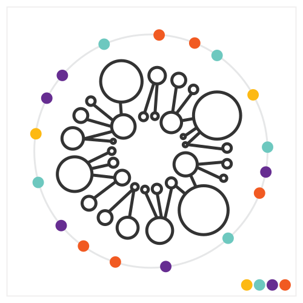

# Dataviz prototype

_**NOTE**_: this repository is just an illustration of the approach mentioned in my talk:

[Iterating dataviz with designers in the loop](https://slides.com/lucyia/iterating-dataviz-with-designers-in-loop)

The sample data is made up.

## v1.1.1_outer_colors

## Mappings
* Iteration on [v0.12.4_circles](https://github.com/lucyia/iterating-dataviz/tree/v0.12.4_circles)
* Circles inner: `level 1`
* Circles outer: `level 2`
* Lines: connected parent-child in hiearchy
* Position: sorted acc. to `type` clockwise
* Small circles around main elements: `type` (each near the element it describes)
  * Color: `category` - ordinal color scale

## Discussion
* Exploring different shapes and positions

## Next steps
* Adding more meaningful data attribute to position of shapes
* Creating color scales
