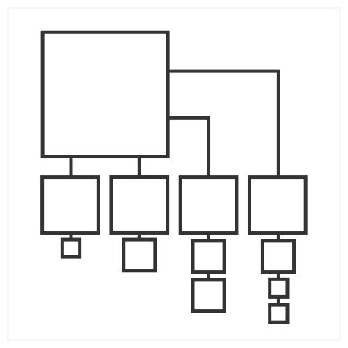

# Dataviz prototype

_**NOTE**_: this repository is just an illustration of the approach mentioned in my talk:

[Iterating dataviz with designers in the loop](https://slides.com/lucyia/iterating-dataviz-with-designers-in-loop)

The sample data is made up.

## V0.5.2_squares

## Mappings
* Square: level 1 - volume
* Position: sorting acc. to size from biggest to smallest - elements connected to show hierarchy

## Discussion
* Exploring different shapes and positions

## Next steps
* Adding more meaningful data attribute to position of shapes
