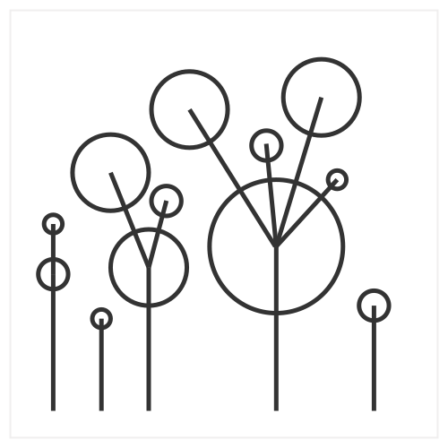

# Dataviz prototype

_**NOTE**_: this repository is just an illustration of the approach mentioned in my talk:

[Iterating dataviz with designers in the loop](https://slides.com/lucyia/iterating-dataviz-with-designers-in-loop)

The sample data is made up.

## v0.10.1_circles

## Mappings
* Lines: length - sum of elements volumes on a given level
* Circle: level 1 and level 2
* Position: random

## Discussion
* Exploring different shapes and positions

## Next steps
* Adding more meaningful data attribute to position of shapes
* Creating color scales
