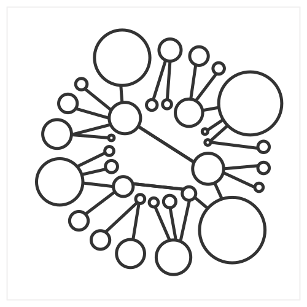

# Dataviz prototype

_**NOTE**_: this repository is just an illustration of the approach mentioned in my talk:

[Iterating dataviz with designers in the loop](https://slides.com/lucyia/iterating-dataviz-with-designers-in-loop)

The sample data is made up.

## v0.12.3_circles

## Mappings
* Circle inner: level 1
* Circle outer: level 2
* Lines: connected parent - child in hiearchy
* Position: sorted acc. to type clockwise

## Discussion
* Exploring different shapes and positions

## Next steps
* Adding more meaningful data attribute to position of shapes
* Creating color scales
